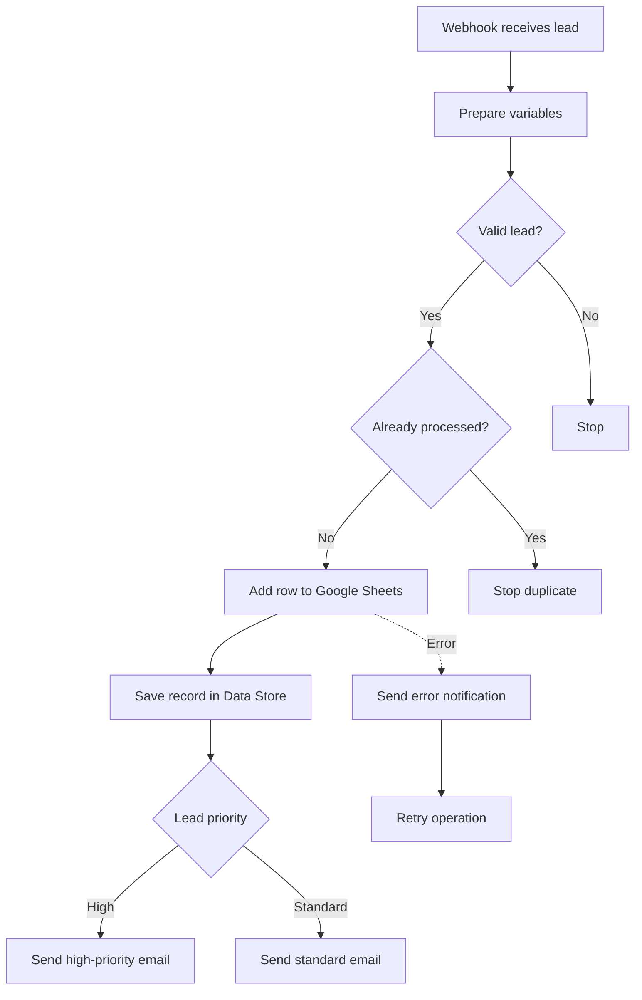
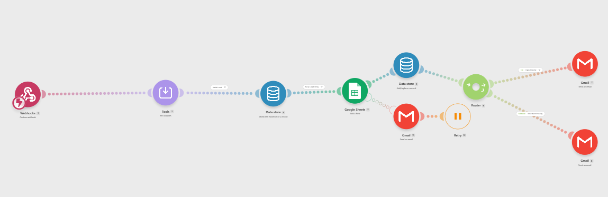
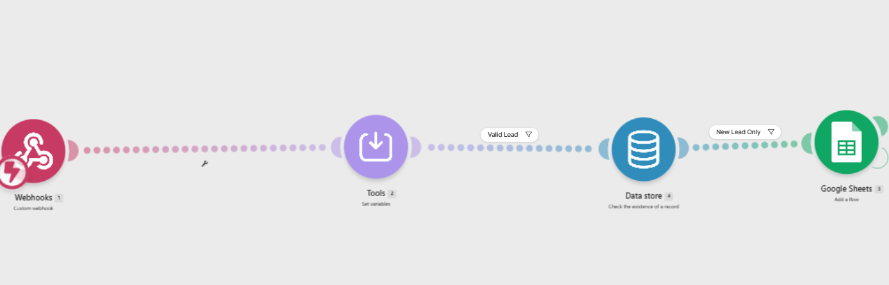
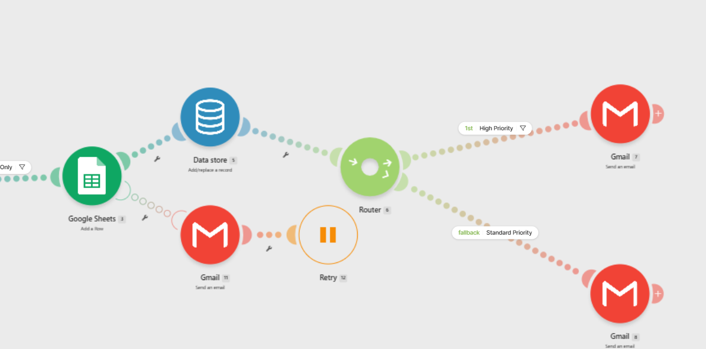

# Client Lead Intake Automation

I built this Make.com workflow to handle new client enquiries in a more organised and consistent way.

Without automation, a new lead may need to be copied manually into a spreadsheet, checked for missing information, classified, and forwarded to the right person. This scenario brings those steps together and reduces the chance of a lead being missed or recorded more than once.

## What the Workflow Does

When a new enquiry reaches the webhook, the workflow:

* Receives the submitted lead information
* Prepares the values for processing
* Checks whether the submission is valid
* Searches the Data Store for an existing record
* Prevents duplicate leads from being added
* Records new leads in Google Sheets
* Saves the processed record in the Data Store
* Routes the lead according to its priority
* Sends the appropriate Gmail notification
* Handles Google Sheets errors through a separate retry route

## Workflow Overview

## Project Screenshots

### Complete Scenario

The full scenario shows the journey from the incoming webhook to lead storage, priority routing, email notifications, and error handling.

### Lead Validation and Duplicate Check

This section prepares the incoming values, validates the submission, checks the Data Store, and allows only new leads to continue to Google Sheets.

### Priority Routing and Error Handling

After a lead is recorded, the scenario stores its identifier and routes it to either the high-priority or standard-priority email path. A separate error route handles problems with the Google Sheets step.

## Tools Used

* Make.com
* Custom webhooks
* Tools and variables
* Make Data Store
* Google Sheets
* Gmail
* Filters
* Router
* Error handlers
* Retry handling

## How It Works

### 1. Receive the Lead

The scenario begins with a custom webhook. This provides an entry point for lead information submitted from an external form or another connected system.

### 2. Prepare the Data

The Tools module sets the values needed by the rest of the scenario. Keeping this preparation near the beginning makes later filters and mappings easier to understand.

### 3. Validate the Submission

The **Valid Lead** filter prevents incomplete or unsuitable submissions from continuing through the main route.

This avoids creating spreadsheet rows or sending notifications for data that should not be processed.

### 4. Check for an Existing Lead

The first Data Store module checks whether a matching record already exists.

The **New Lead Only** filter allows the scenario to continue only when the lead has not already been processed. This adds a simple form of duplicate protection and helps keep the spreadsheet clean.

### 5. Add the Lead to Google Sheets

A new row is added to Google Sheets so the lead can be reviewed and managed from one central location.

The spreadsheet provides a straightforward record for follow-up without requiring someone to copy the submission manually.

### 6. Record the Processed Lead

After the spreadsheet step succeeds, the second Data Store module adds or replaces the corresponding record.

This gives the scenario a reference it can use when checking future submissions.

### 7. Route by Priority

The router separates the workflow into two notification paths:

* **High Priority** sends the lead through the first Gmail route
* **Standard Priority** uses the fallback Gmail route

Using separate routes makes it possible to change the message, recipient, or follow-up process for each priority level.

### 8. Handle Spreadsheet Errors

The Google Sheets module also has a separate error-handling path.

If that step fails, the scenario sends an email notification and passes the operation to a Retry module. This prevents an important failure from going unnoticed and provides a controlled way to try the operation again.

## Important Design Decisions

### Using a Data Store for Duplicate Protection

I did not want every webhook request to create another spreadsheet row automatically. Checking the Data Store first allows the workflow to identify leads that have already been processed.

### Separating High and Standard Priorities

High-priority enquiries may need a faster response or a different email message. The router keeps this logic visible and makes each route easier to update.

### Adding a Dedicated Error Route

A successful webhook request does not guarantee that every connected service will work. The error route makes the Google Sheets step more reliable by sending a notification and supporting a retry.

### Keeping the Spreadsheet as the Main Lead Log

Google Sheets was used because it provides a familiar and accessible place to review incoming leads. It could later be replaced by a CRM without changing the overall purpose of the workflow.

## Business Value

This workflow can help a small business or service provider:

* Reduce manual data entry
* Respond to important enquiries faster
* Keep lead information in one place
* Avoid creating duplicate records
* Apply the same process to every submission
* Detect spreadsheet failures instead of losing leads silently
* Spend less time sorting and forwarding enquiries

## Testing

The workflow was completed and tested before being documented in this repository.

The main areas checked included:

* Receiving data through the webhook
* Allowing valid leads to continue
* Preventing existing records from being processed again
* Adding new leads to Google Sheets
* Saving processed records in the Data Store
* Routing leads through the correct priority path
* Sending Gmail notifications
* Handling errors through the notification and retry route

A new fictional test result will be added after the Make.com operation allowance resets.

## Privacy and Security

The screenshots in this repository do not include real client information, credentials, API keys, connection details, or webhook URLs.

For a live implementation, access to the spreadsheet, email connection, webhook, and Data Store should be limited to authorised users.

## What I Learned

This project helped me practise more than connecting modules in a straight line. I worked with validation filters, duplicate prevention, conditional routing, persistent records, email notifications, and error handling within one scenario.

It also reinforced the importance of thinking about what should happen when a submission is invalid, already exists, or cannot be written to the destination system.

## Possible Improvements

Future versions could include:

* Direct integration with a CRM
* Automatic lead assignment
* Follow-up reminders
* Lead-source tracking
* Response-time reporting
* A confirmation email for the person submitting the enquiry
* More detailed error logging
* A dashboard showing lead volume and priority

## Project Status

**Completed and previously tested**

The core workflow is working. Additional fictional test evidence will be added when the Make.com operation allowance becomes available again.
